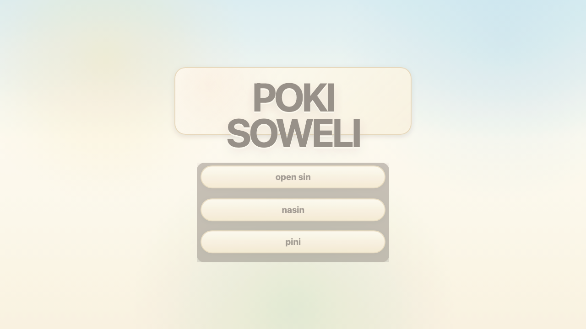
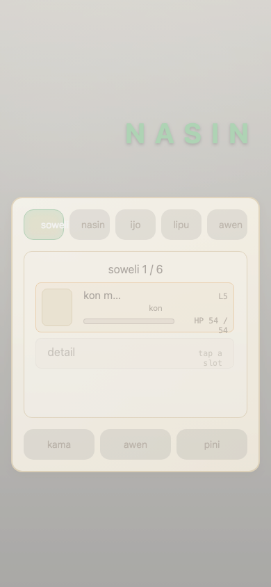
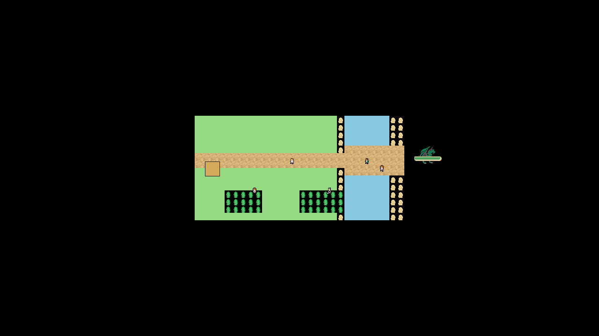

# poki soweli


A cozy creature-catching RPG whose world is named in toki pona. Players walk between villages, catch creatures with a **poki** (net), build a party of up to six, and beat the current four **jan lawa** (region masters) to reach the final boss. Vocabulary lands **diegetically** — the player never translates; the language simply saturates the world.

Cozy village-fable energy. Kid-safe, no permadeath, no punishing mechanics. Warm and cute, not edgy.

## Visual snapshot

| Title                                                                                                       | Mobile HUD                                                                                            | Endgame Route                                                                                                         |
| ----------------------------------------------------------------------------------------------------------- | ----------------------------------------------------------------------------------------------------- | --------------------------------------------------------------------------------------------------------------------- |
|  |  |  |

Curated Playwright captures live in `docs/screenshots/visual-audit/`; the source audit also captures every authored map canvas for tile-placement review.

## Run it

```sh
pnpm install
pnpm dev            # vite at http://localhost:5173/ (or next free port)
```

## What makes it interesting

-   **No translation UI.** The player never sees an English gloss. Over a playthrough they pick up ~120 TP words simply by playing.
-   **Every line of user-facing TP is corpus-verified.** `src/content/corpus/tatoeba.json` is a vendored 37,666-pair CC BY 2.0 FR Tatoeba corpus. Authors write English; the build pipeline round-trips every line through the corpus to produce canonical TP. Hand-authored TP is banned; `pnpm validate-tp` gates every PR.
-   **Maps are build artifacts.** Hand-edited `.tmx` / `.tmj` files never land in this repo. Every map is authored as a TypeScript spec under `scripts/map-authoring/specs/<id>.ts` and emitted by `pnpm author:build <id>`, including the review preview PNG. `pnpm author:verify` enforces TMX/TMJ drift in `validate` + `prebuild` + CI, and the unit suite pixel-diffs committed previews against fresh renderer output.
-   **Single coherent art direction** using the Fan-tasy tileset family (6 biome packs) plus creature tiering by animation depth — rare encounters animate, common encounters are static. See `docs/ARCHITECTURE.md`.
-   **Mobile-first HUD, native RPG.js GUI.** `.ce` (CanvasEngine) components for every overlay, tap-to-walk input, warm cream + emerald + amber palette via `src/styles/brand.css` with self-hosted Nunito / Fredoka / JetBrains Mono / nasin-nanpa fonts. No CDN, no external dependencies at runtime. See `docs/UX.md`.
-   **Docs > tests > code order.** Docs describe what the game must be; tests describe what the code must do; code satisfies both. See `CLAUDE.md` + `AGENTS.md`.

## Commands

```sh
pnpm install              # bootstrap
pnpm dev                  # vite dev server (local base = /)
pnpm build                # prebuild (validate + build-spine + typecheck) then vite build
pnpm preview              # preview the built bundle

GITHUB_PAGES=true pnpm build   # Pages build (base = /poki-soweli/)
CAPACITOR=true pnpm build      # Capacitor build (base = ./)

pnpm validate             # validate-challenges + validate-tp + author:verify
pnpm validate-tp          # every EN string must resolve through the Tatoeba corpus
pnpm build-spine          # compile spine JSON + map objects → generated/world.json
pnpm typecheck            # tsc --noEmit across src/vite + map-authoring + unit/integration TS
pnpm format:src           # Prettier pass over supported src/ TS/JSON/CSS/MD files
pnpm format:src:check     # verify the supported src/ formatting contract
pnpm workflow:check       # actionlint + shellcheck for GitHub Actions
pnpm release:smoke-artifacts "$RELEASE_TAG"  # package/validate local handoff artifacts
pnpm maestro:check        # syntax-check Android/iOS mobile QA flows

pnpm test                 # both vitest projects (unit + integration)
pnpm test:unit            # pure/build-time suite (node env, serialized)
pnpm test:integration     # real RPG.js engine in-process via @rpgjs/testing
pnpm test:coverage        # coverage gate on unit project

pnpm test:e2e:smoke       # real browser via Playwright — boot smoke
pnpm test:e2e:full        # full Playwright suite (local only)

pnpm author:build <id>    # rebuild one map from its spec
pnpm author:all --all     # rebuild every map
pnpm author:all --all --dry-run  # validate/emits/renders without rewriting map artifacts
pnpm author:verify        # gate — fail if any .tmx/.tmj drifts from its spec

pnpm android:build-debug  # build Capacitor debug APK locally
pnpm maestro:android      # run Android debug APK smoke on a booted emulator
pnpm maestro:ios          # run iOS Safari Pages smoke on a booted simulator
```

## Structure

| Path                        | What it is                                                                                                                              |
| --------------------------- | --------------------------------------------------------------------------------------------------------------------------------------- |
| `src/standalone.ts`         | Dev entry — RPG.js v5 client + server in one process                                                                                    |
| `src/server.ts`             | `createServer()` with Capacitor save storage + tiledmap + main module                                                                   |
| `src/modules/main/`         | Player hooks, NPC events, gym leaders, pure-logic game modules                                                                          |
| `src/platform/persistence/` | Capacitor preferences + SQLite adapters                                                                                                 |
| `src/styles/`               | `brand.css`, `fonts.css`, pure-logic style helpers                                                                                      |
| `src/tiled/`                | Generated `.tmx` maps (build artifacts) consumed by `tiledMapFolderPlugin`                                                              |
| `src/content/spine/`        | Hand-authored content JSON (species, moves, journey, items, dialog)                                                                     |
| `src/content/generated/`    | Compiled `world.json` (committed for reproducibility)                                                                                   |
| `src/content/corpus/`       | Vendored Tatoeba TP↔EN corpus (immutable)                                                                                              |
| `src/content/schema/`       | Zod schemas — source of truth for content shape                                                                                         |
| `scripts/map-authoring/`    | Map spec compiler + renderer + verifier                                                                                                 |
| `public/assets/`            | Fan-tasy tilesets, player sprites, creatures, NPCs, effects, fonts                                                                      |
| `docs/`                     | `STATE` / `ROADMAP` / `ARCHITECTURE` / `DESIGN` / `BRAND` / `UX` / `TESTING` / `JOURNEY` / `LORE` / `GLOSSARY` / `WRITING_RULES` + more |
| `tests/build-time/`         | Vitest unit suite (pure logic)                                                                                                          |
| `tests/integration/`        | `@rpgjs/testing` in-process engine suite                                                                                                |
| `tests/e2e/`                | Playwright real-browser suite (smoke + full)                                                                                            |

## Contributing

-   Read `CLAUDE.md`, `AGENTS.md`, and at minimum `docs/STATE.md` + `docs/ROADMAP.md` before making changes.
-   Work on a feature branch, open a PR against `main`. Never push to `main`.
-   CI must be green before merge; address every review comment.
-   [Conventional Commits](https://www.conventionalcommits.org/) always (`feat:` / `fix:` / `chore:` / `docs:` / `refactor:` / `perf:` / `test:` / `ci:` / `build:`).
-   Squash-merge.
-   GitHub Actions are pinned to exact commit SHAs (latest stable). Dependabot-proposed `@vN` tag bumps are rejected in favor of SHA pins.

## License

-   **Code** — see `LICENSE`.
-   **Tatoeba corpus** — `src/content/corpus/tatoeba.json` is CC BY 2.0 FR. See `src/content/corpus/LICENSE.md`.
-   **Fonts** — Nunito, Fredoka, JetBrains Mono, and nasin-nanpa all ship under SIL Open Font License 1.1. Each family directory under `public/assets/fonts/` retains its original `OFL.txt`.
-   **Art assets** — Fan-tasy tileset packs; see `public/assets/CREDITS.md` for per-pack provenance.
